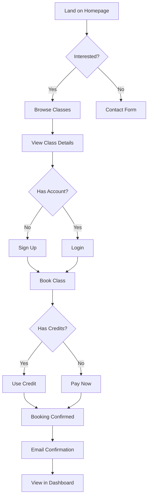
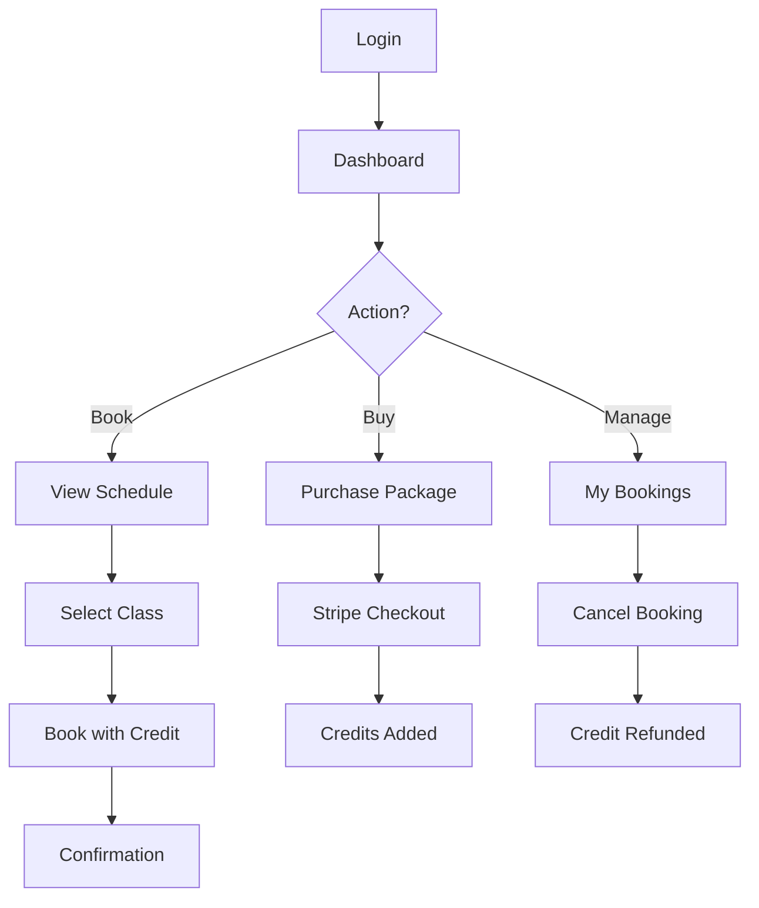
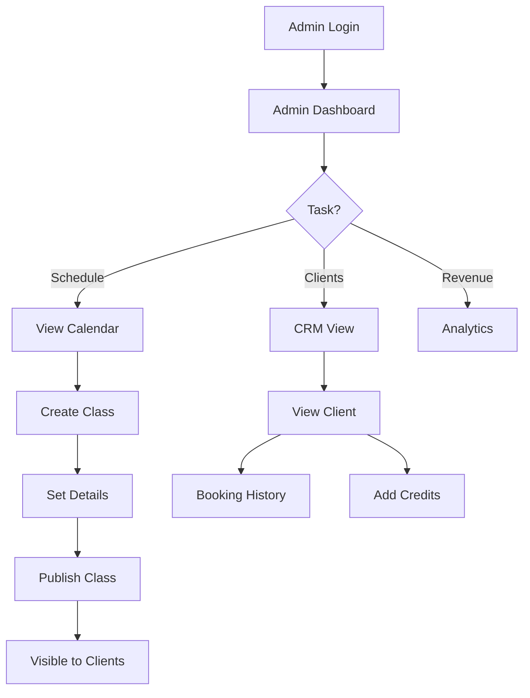

# Frontend Architecture Specification
# Wellness Hub Platform

**Created:** 2025-12-14  
**UX Expert:** AI Agent (Self-Annealing BMAD)  
**Status:** Complete

---

## User Flows

### Flow 1: New Visitor → First Booking



---

### Flow 2: Returning Client → Repeat Booking



---

### Flow 3: Admin → Manage Schedule



---

## Page Hierarchy

```
/
├── / (Landing Page)
│   ├── Hero
│   ├── About Instructor
│   ├── Class Showcase
│   ├── Testimonials
│   └── Contact Form
│
├── /schedule (Public Schedule)
│   ├── Calendar View
│   └── Class List
│
├── /auth
│   ├── /login
│   ├── /register
│   └── /reset-password
│
├── /dashboard (Client Dashboard) [Protected]
│   ├── / (Overview)
│   ├── /bookings (My Bookings)
│   ├── /profile (Edit Profile)
│   ├── /payments (Payment History)
│   └── /packages (Buy Packages)
│
├── /admin (Admin Dashboard) [Admin Only]
│   ├── / (Analytics Overview)
│   ├── /bookings (All Bookings)
│   ├── /clients (CRM)
│   │   └── /[id] (Client Detail)
│   ├── /schedule (Manage Schedule)
│   └── /payments (Payment Tracking)
│
├── /success (Payment Success)
└── /cancel (Payment Cancelled)
```

---

## Component Tree

### Landing Page Components

```
LandingPage
├── Navbar
│   ├── Logo
│   ├── NavLinks
│   │   ├── Home
│   │   ├── Classes
│   │   ├── About
│   │   └── Login/Dashboard (dynamic)
│   └── MobileMenu (hamburger)
│
├── Hero
│   ├── Headline
│   ├── Subheadline
│   ├── CTAButton ("Book Your First Class")
│   └── InstructorImage (glassmorphism card)
│
├── AboutSection
│   ├── InstructorBio
│   ├── Credentials
│   ├── TeachingPhilosophy
│   └── ProfileImage
│
├── ClassesShowcase
│   ├── SectionHeader
│   └── ClassGrid
│       └── ClassCard[] (map over class types)
│           ├── ClassImage
│           ├── ClassName
│           ├── Description
│           ├── PriceBadge
│           ├── DifficultyBadge
│           └── BookButton
│
├── Testimonials
│   ├── SectionHeader
│   └── TestimonialCarousel
│       └── TestimonialCard[]
│           ├── QuoteIcon
│           ├── Quote
│           ├── ClientName
│           ├── ClientPhoto
│           └── StarRating
│
├── ContactForm
│   ├── FormHeader
│   └── Form
│       ├── NameInput
│       ├── EmailInput
│       ├── MessageTextarea
│       └── SubmitButton
│
└── Footer
    ├── SocialLinks
    ├── ContactInfo
    └── Copyright
```

---

### Dashboard Components (Client)

```
ClientDashboardLayout
├── DashboardSidebar
│   ├── UserProfile (avatar + name)
│   ├── NavLinks
│   │   ├── Overview
│   │   ├── My Bookings
│   │   ├── Buy Packages
│   │   ├── Profile
│   │   └── Payments
│   └── LogoutButton
│
└── DashboardContent (dynamic per page)
    │
    ├── Overview Page
    │   ├── WelcomeHeader
    │   ├── StatsGrid
    │   │   ├── CreditsCard
    │   │   ├── UpcomingClassesCard
    │   │   └── TotalClassesCard
    │   ├── NextClassHighlight
    │   └── QuickActions
    │       ├── BookClassButton
    │       └── BuyPackageButton
    │
    ├── Bookings Page
    │   ├── Tabs (Upcoming / Past)
    │   └── BookingsList
    │       └── BookingCard[]
    │           ├── ClassInfo
    │           ├── DateTime
    │           ├── Location
    │           ├── StatusBadge
    │           └── CancelButton (if upcoming)
    │
    ├── Packages Page
    │   ├── CurrentCredits
    │   └── PackageGrid
    │       └── PackageCard[]
    │           ├── PackageName
    │           ├── CreditsCount
    │           ├── Price
    │           ├── PricePerClass
    │           └── PurchaseButton
    │
    └── Payments Page
        ├── FilterBar (date range)
        └── PaymentTable
            └── PaymentRow[]
                ├── Date
                ├── Description
                ├── Amount
                ├── Status
                └── ReceiptLink
```

---

### Admin Dashboard Components

```
AdminDashboardLayout
├── AdminSidebar
│   ├── AdminProfile
│   ├── NavLinks
│   │   ├── Analytics
│   │   ├── Bookings
│   │   ├── Clients
│   │   ├── Schedule
│   │   └── Payments
│   └── LogoutButton
│
└── AdminContent
    │
    ├── Analytics Page
    │   ├── MetricsGrid
    │   │   ├── TotalRevenueCard
    │   │   ├── TotalBookingsCard
    │   │   ├── ActiveClientsCard
    │   │   └── MonthlyRevenueCard
    │   ├── ChartsSection
    │   │   ├── RevenueChart (line/bar)
    │   │   └── BookingsChart
    │   └── PopularClassesTable
    │
    ├── Bookings Management
    │   ├── FilterBar (date, class, status)
    │   ├── SearchInput
    │   ├── ExportButton (CSV)
    │   └── BookingsTable
    │       └── BookingRow[]
    │           ├── ClientName (link to profile)
    │           ├── ClassName
    │           ├── DateTime
    │           ├── PaymentStatus
    │           └── Actions (view, cancel)
    │
    ├── CRM (Clients)
    │   ├── FilterBar
    │   ├── SearchInput
    │   ├── ExportButton
    │   └── ClientsTable
    │       └── ClientRow[]
    │           ├── Name (link to detail)
    │           ├── Email
    │           ├── JoinDate
    │           ├── TotalClasses
    │           ├── Credits
    │           └── QuickActions
    │
    ├── Client Detail
    │   ├── ClientHeader (name, photo, contact)
    │   ├── StatsRow (classes, credits, spend)
    │   ├── Tabs (Bookings / Payments / Notes)
    │   ├── BookingHistoryTable
    │   ├── PaymentHistoryTable
    │   └── AdminNotesSection
    │
    └── Schedule Management
        ├── CalendarView
        ├── CreateClassButton (opens modal)
        ├── ClassSessionsList
        │   └── SessionCard[]
        │       ├── ClassInfo
        │       ├── DateTime
        │       ├── Capacity (X/Y booked)
        │       ├── BookedClientsList
        │       └── Actions (edit, cancel)
        └── CreateClassModal
            ├── ClassTypeSelect
            ├── DatePicker
            ├── TimePicker
            ├── DurationInput
            ├── CapacityInput
            └── LocationInput
```

---

## State Management Strategy

### Global State (Zustand)

**User State:**
```typescript
interface UserStore {
  user: User | null
  profile: Profile | null
  role: 'client' | 'admin' | null
  credits: number
  setUser: (user: User) => void
  setProfile: (profile: Profile) => void
  logout: () => void
}
```

**UI State:**
```typescript
interface UIStore {
  sidebarOpen: boolean
  setSidebarOpen: (open: boolean) => void
  theme: 'light' | 'dark'
  setTheme: (theme: 'light' | 'dark') => void
}
```

---

### Server State (TanStack Query)

**Query Keys:**
```typescript
const queryKeys = {
  // Classes
  classes: ['classes'],
  classTypes: ['class-types'],
  classSessions: ['class-sessions'],
  classSession: (id: string) => ['class-session', id],
  
  // Bookings
  userBookings: (userId: string) => ['bookings', userId],
  allBookings: ['bookings', 'all'],
  
  // Payments
  userPayments: (userId: string) => ['payments', userId],
  allPayments: ['payments', 'all'],
  
  // Clients (admin)
  clients: ['clients'],
  client: (id: string) => ['client', id],
  
  // Analytics
  analytics: ['analytics'],
  revenue: ['revenue'],
}
```

**Mutations:**
```typescript
// Booking mutations
useCreateBooking()
useCancelBooking()

// Payment mutations
useCreateCheckoutSession()
useProcessPayment()

// Admin mutations
useCreateClassSession()
useUpdateClassSession()
useCancelClassSession()
useAddCreditsToClient()
```

---

## Routing Structure

### Next.js App Router

```
src/app/
├── layout.tsx (root layout with providers)
├── page.tsx (landing page)
├── globals.css
│
├── auth/
│   ├── login/page.tsx
│   ├── register/page.tsx
│   └── reset-password/page.tsx
│
├── schedule/
│   └── page.tsx (public schedule)
│
├── dashboard/
│   ├── layout.tsx (dashboard shell + sidebar)
│   ├── page.tsx (overview)
│   ├── bookings/page.tsx
│   ├── packages/page.tsx
│   ├── profile/page.tsx
│   └── payments/page.tsx
│
├── admin/
│   ├── layout.tsx (admin shell + sidebar)
│   ├── page.tsx (analytics)
│   ├── bookings/page.tsx
│   ├── clients/
│   │   ├── page.tsx (list)
│   │   └── [id]/page.tsx (detail)
│   ├── schedule/page.tsx
│   └── payments/page.tsx
│
├── success/page.tsx (Stripe redirect)
├── cancel/page.tsx (Stripe redirect)
│
└── api/
    └── stripe/
        ├── checkout/route.ts
        └── webhook/route.ts
```

---

## UI Component Library (shadcn/ui)

### Components to Install

```bash
npx shadcn-ui@latest add button
npx shadcn-ui@latest add card
npx shadcn-ui@latest add dialog
npx shadcn-ui@latest add form
npx shadcn-ui@latest add input
npx shadcn-ui@latest add label
npx shadcn-ui@latest add select
npx shadcn-ui@latest add table
npx shadcn-ui@latest add tabs
npx shadcn-ui@latest add calendar
npx shadcn-ui@latest add toast
npx shadcn-ui@latest add badge
npx shadcn-ui@latest add avatar
npx shadcn-ui@latest add dropdown-menu
npx shadcn-ui@latest add sheet (for mobile sidebar)
```

### Custom Components (Built from scratch)

- `<GlassCard />` - Glassmorphism effect card
- `<GradientButton />` - CTA button with gradient
- `<AnimatedCounter />` - Counting animation for stats
- `<LoadingSpinner />` - Custom loading animation
- `<EmptyState />` - Empty state illustrations

---

## Responsive Design Approach

### Breakpoints (Tailwind)

```typescript
const breakpoints = {
  sm: '640px',   // Mobile landscape
  md: '768px',   // Tablet
  lg: '1024px',  // Desktop
  xl: '1280px',  // Large desktop
  '2xl': '1536px', // Extra large
}
```

### Mobile-First Strategy

1. **Default (Mobile):** Single column, stacked sections
2. **md (Tablet):** Two-column grids, side-by-side cards
3. **lg (Desktop):** Full layout with sidebar, multi-column grids

### Responsive Patterns

**Navigation:**
- Mobile: Hamburger menu → Full-screen drawer
- Desktop: Horizontal nav bar

**Dashboard Sidebar:**
- Mobile: Bottom navigation or drawer
- Desktop: Fixed left sidebar

**Tables:**
- Mobile: Card-based stacked view
- Desktop: Traditional table

**Forms:**
- Mobile: Full-width, stacked inputs
- Desktop: Multi-column grid

---

## Accessibility Standards

### WCAG 2.1 Level AA Compliance

**Color Contrast:**
- Text: Minimum 4.5:1 ratio
- Large text: Minimum 3:1 ratio
- Interactive elements: Clear focus states

**Keyboard Navigation:**
- All interactive elements keyboard accessible
- Logical tab order
- Visible focus indicators
- Skip-to-content link

**Screen Reader Support:**
- Semantic HTML elements
- ARIA labels where needed
- Form labels properly associated
- Image alt text descriptive

**Focus Management:**
- Modal focus trap
- Return focus on close
- Focus visible on keyboard nav

---

## Design Tokens

### Color Palette

```css
:root {
  /* Primary - Sage Green */
  --primary-50: #f4f6f3;
  --primary-100: #e8ede6;
  --primary-200: #d1dbc9;
  --primary-300: #b9c8ac;
  --primary-400: #a2b68f;
  --primary-500: #8b9d83; /* Main */
  --primary-600: #6f7e69;
  --primary-700: #535e4f;
  --primary-800: #383f34;
  --primary-900: #1c1f1a;
  
  /* Secondary - Earth Tone */
  --secondary-500: #D4A574;
  --secondary-600: #c0935a;
  
  /* Accent - Lavender */
  --accent-500: #C9B8D9;
  --accent-600: #b8a4ca;
  
  /* Neutrals */
  --neutral-50: #faf9f6; /* Cream background */
  --neutral-100: #f5f4f1;
  --neutral-200: #e8e6e1;
  --neutral-300: #d1cec7;
  --neutral-500: #9a9690;
  --neutral-700: #5a5751;
  --neutral-900: #2a2824;
  
  /* Semantic */
  --success: #6fb87f;
  --error: #e87171;
  --warning: #f3b765;
}
```

### Typography

```css
:root {
  /* Font Families */
  --font-heading: 'Outfit', sans-serif;
  --font-body: 'Inter', sans-serif;
  
  /* Font Sizes (fluid) */
  --text-xs: clamp(0.75rem, 0.7rem + 0.25vw, 0.875rem);
  --text-sm: clamp(0.875rem, 0.8rem + 0.375vw, 1rem);
  --text-base: clamp(1rem, 0.9rem + 0.5vw, 1.125rem);
  --text-lg: clamp(1.125rem, 1rem + 0.625vw, 1.25rem);
  --text-xl: clamp(1.25rem, 1.1rem + 0.75vw, 1.5rem);
  --text-2xl: clamp(1.5rem, 1.3rem + 1vw, 2rem);
  --text-3xl: clamp(1.875rem, 1.6rem + 1.375vw, 2.5rem);
  --text-4xl: clamp(2.25rem, 1.9rem + 1.75vw, 3rem);
  
  /* Line Heights */
  --leading-tight: 1.2;
  --leading-normal: 1.5;
  --leading-relaxed: 1.75;
}
```

### Spacing Scale

```css
:root {
  --space-1: 0.25rem;  /* 4px */
  --space-2: 0.5rem;   /* 8px */
  --space-3: 0.75rem;  /* 12px */
  --space-4: 1rem;     /* 16px */
  --space-5: 1.25rem;  /* 20px */
  --space-6: 1.5rem;   /* 24px */
  --space-8: 2rem;     /* 32px */
  --space-10: 2.5rem;  /* 40px */
  --space-12: 3rem;    /* 48px */
  --space-16: 4rem;    /* 64px */
  --space-20: 5rem;    /* 80px */
}
```

### Border Radius

```css
:root {
  --radius-sm: 0.375rem;  /* 6px */
  --radius-md: 0.5rem;    /* 8px */
  --radius-lg: 0.75rem;   /* 12px */
  --radius-xl: 1rem;      /* 16px */
  --radius-2xl: 1.5rem;   /* 24px */
  --radius-full: 9999px;  /* Pill shape */
}
```

### Shadows

```css
:root {
  --shadow-sm: 0 1px 2px 0 rgb(0 0 0 / 0.05);
  --shadow-md: 0 4px 6px -1px rgb(0 0 0 / 0.1);
  --shadow-lg: 0 10px 15px -3px rgb(0 0 0 / 0.1);
  --shadow-xl: 0 20px 25px -5px rgb(0 0 0 / 0.1);
  
  /* Glassmorphism */
  --glass-shadow: 0 8px 32px 0 rgba(31, 38, 135, 0.15);
}
```

---

## Animation & Transitions

### Micro-interactions

**Hover Effects:**
```css
.hover-lift {
  transition: transform 0.2s ease, box-shadow 0.2s ease;
}
.hover-lift:hover {
  transform: translateY(-4px);
  box-shadow: var(--shadow-lg);
}
```

**Button Press:**
```css
.button {
  transition: transform 0.1s ease;
}
.button:active {
  transform: scale(0.98);
}
```

**Fade In:**
```css
@keyframes fadeIn {
  from { opacity: 0; }
  to { opacity: 1; }
}
.fade-in {
  animation: fadeIn 0.3s ease-in;
}
```

**Slide Up:**
```css
@keyframes slideUp {
  from {
    opacity: 0;
    transform: translateY(20px);
  }
  to {
    opacity: 1;
    transform: translateY(0);
  }
}
.slide-up {
  animation: slideUp 0.4s ease-out;
}
```

---

## Performance Considerations

### Image Optimization
- Use Next.js `<Image />` component
- Lazy loading for below-fold images
- WebP format with fallbacks
- Responsive srcsets

### Code Splitting
- Route-based automatic splitting (Next.js)
- Dynamic imports for heavy components
- Lazy load admin dashboard components

### Caching Strategy
- Static pages: ISR (Incremental Static Regeneration)
- Dynamic data: Cache with TanStack Query
- Images: CDN caching via Vercel

---

**Status:** ✅ Frontend Spec Complete  
**Next Phase:** Architect (`/architect`)  
**Created:** 2025-12-14
