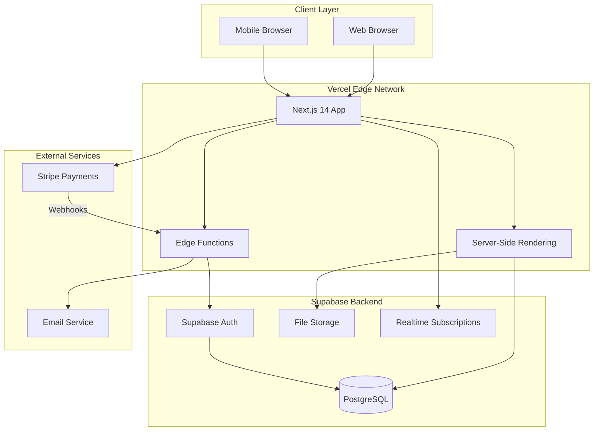
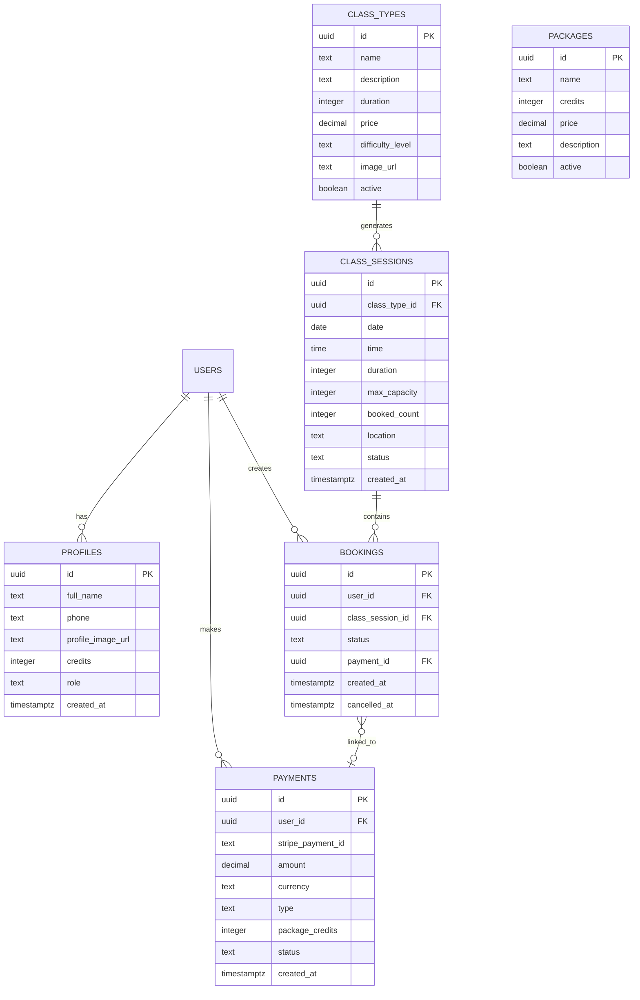
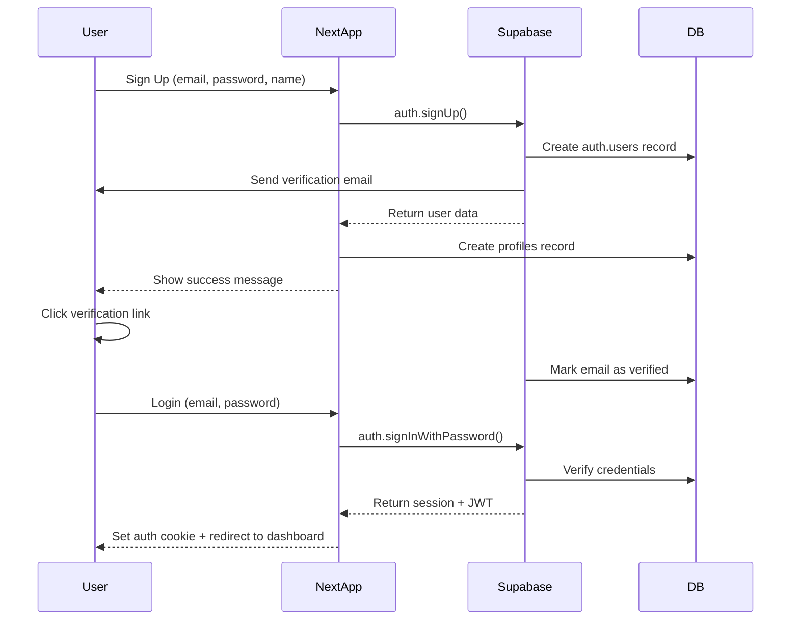
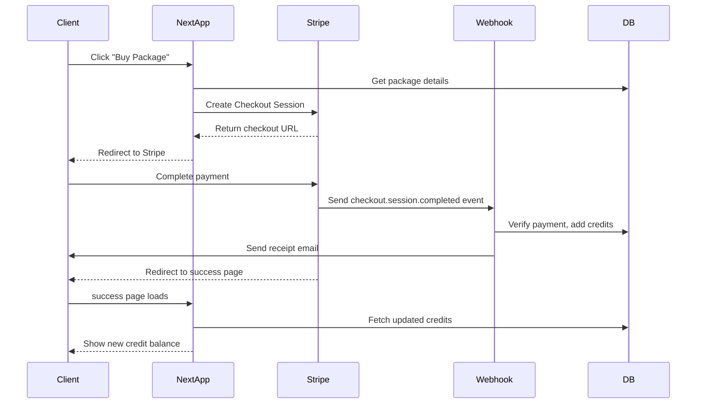

# System Architecture
# Wellness Hub Platform

**Created:** 2025-12-14  
**Architect:** AI Agent (Self-Annealing BMAD)  
**Status:** Complete

---

## Architecture Overview



---

## Database Schema (PostgreSQL via Supabase)

### Entity Relationship Diagram



---

### Detailed Table Definitions

#### **profiles**
```sql
CREATE TABLE profiles (
  id UUID PRIMARY KEY REFERENCES auth.users(id) ON DELETE CASCADE,
  full_name TEXT NOT NULL,
  phone TEXT,
  profile_image_url TEXT,
  credits INTEGER DEFAULT 0 CHECK (credits >= 0),
  role TEXT DEFAULT 'client' CHECK (role IN ('client', 'admin')),
  created_at TIMESTAMPTZ DEFAULT NOW(),
  updated_at TIMESTAMPTZ DEFAULT NOW()
);

-- Indexes
CREATE INDEX idx_profiles_role ON profiles(role);
CREATE INDEX idx_profiles_credits ON profiles(credits);

-- RLS Policies
ALTER TABLE profiles ENABLE ROW LEVEL SECURITY;

-- Users can view all profiles
CREATE POLICY "Profiles are viewable by everyone"
  ON profiles FOR SELECT
  USING (true);

-- Users can update their own profile
CREATE POLICY "Users can update own profile"
  ON profiles FOR UPDATE
  USING (auth.uid() = id);

-- Admins can update any profile
CREATE POLICY "Admins can update any profile"
  ON profiles FOR UPDATE
  USING (
    EXISTS (
      SELECT 1 FROM profiles
      WHERE id = auth.uid() AND role = 'admin'
    )
  );
```

---

#### **class_types**
```sql
CREATE TABLE class_types (
  id UUID PRIMARY KEY DEFAULT gen_random_uuid(),
  name TEXT NOT NULL,
  description TEXT,
  duration INTEGER NOT NULL CHECK (duration > 0), -- minutes
  price DECIMAL(10,2) NOT NULL CHECK (price >= 0),
  difficulty_level TEXT CHECK (difficulty_level IN ('beginner', 'intermediate', 'advanced')),
  image_url TEXT,
  active BOOLEAN DEFAULT TRUE,
  created_at TIMESTAMPTZ DEFAULT NOW()
);

-- Indexes
CREATE INDEX idx_class_types_active ON class_types(active);

-- RLS Policies
ALTER TABLE class_types ENABLE ROW LEVEL SECURITY;

-- Public read
CREATE POLICY "Class types are publicly readable"
  ON class_types FOR SELECT
  USING (active = true OR EXISTS (
    SELECT 1 FROM profiles WHERE id = auth.uid() AND role = 'admin'
  ));

-- Admin write
CREATE POLICY "Admins can manage class types"
  ON class_types FOR ALL
  USING (
    EXISTS (
      SELECT 1 FROM profiles WHERE id = auth.uid() AND role = 'admin'
    )
  );
```

---

#### **class_sessions**
```sql
CREATE TABLE class_sessions (
  id UUID PRIMARY KEY DEFAULT gen_random_uuid(),
  class_type_id UUID NOT NULL REFERENCES class_types(id) ON DELETE CASCADE,
  date DATE NOT NULL,
  time TIME NOT NULL,
  duration INTEGER NOT NULL CHECK (duration > 0),
  max_capacity INTEGER DEFAULT 10 CHECK (max_capacity > 0),
  booked_count INTEGER DEFAULT 0 CHECK (booked_count >= 0 AND booked_count <= max_capacity),
  location TEXT,
  status TEXT DEFAULT 'scheduled' CHECK (status IN ('scheduled', 'cancelled')),
  created_at TIMESTAMPTZ DEFAULT NOW(),
  updated_at TIMESTAMPTZ DEFAULT NOW()
);

-- Indexes
CREATE INDEX idx_class_sessions_date ON class_sessions(date);
CREATE INDEX idx_class_sessions_status ON class_sessions(status);
CREATE INDEX idx_class_sessions_class_type ON class_sessions(class_type_id);

-- Composite index for common queries
CREATE INDEX idx_class_sessions_date_status ON class_sessions(date, status);

-- RLS Policies
ALTER TABLE class_sessions ENABLE ROW LEVEL SECURITY;

-- Public read for scheduled sessions
CREATE POLICY "Class sessions are publicly readable"
  ON class_sessions FOR SELECT
  USING (status = 'scheduled' OR EXISTS (
    SELECT 1 FROM profiles WHERE id = auth.uid() AND role = 'admin'
  ));

-- Admin write
CREATE POLICY "Admins can manage class sessions"
  ON class_sessions FOR ALL
  USING (
    EXISTS (
      SELECT 1 FROM profiles WHERE id = auth.uid() AND role = 'admin'
    )
  );
```

---

#### **bookings**
```sql
CREATE TABLE bookings (
  id UUID PRIMARY KEY DEFAULT gen_random_uuid(),
  user_id UUID NOT NULL REFERENCES auth.users(id) ON DELETE CASCADE,
  class_session_id UUID NOT NULL REFERENCES class_sessions(id) ON DELETE CASCADE,
  status TEXT DEFAULT 'confirmed' CHECK (status IN ('confirmed', 'cancelled')),
  payment_id UUID REFERENCES payments(id),
  created_at TIMESTAMPTZ DEFAULT NOW(),
  cancelled_at TIMESTAMPTZ,
  
  -- Prevent duplicate bookings
  UNIQUE(user_id, class_session_id)
);

-- Indexes
CREATE INDEX idx_bookings_user ON bookings(user_id);
CREATE INDEX idx_bookings_session ON bookings(class_session_id);
CREATE INDEX idx_bookings_status ON bookings(status);

-- RLS Policies
ALTER TABLE bookings ENABLE ROW LEVEL SECURITY;

-- Users can view their own bookings
CREATE POLICY "Users can view own bookings"
  ON bookings FOR SELECT
  USING (auth.uid() = user_id OR EXISTS (
    SELECT 1 FROM profiles WHERE id = auth.uid() AND role = 'admin'
  ));

-- Users can create bookings for themselves
CREATE POLICY "Users can create own bookings"
  ON bookings FOR INSERT
  WITH CHECK (auth.uid() = user_id);

-- Users can update their own bookings (cancel)
CREATE POLICY "Users can update own bookings"
  ON bookings FOR UPDATE
  USING (auth.uid() = user_id OR EXISTS (
    SELECT 1 FROM profiles WHERE id = auth.uid() AND role = 'admin'
  ));
```

---

#### **payments**
```sql
CREATE TABLE payments (
  id UUID PRIMARY KEY DEFAULT gen_random_uuid(),
  user_id UUID NOT NULL REFERENCES auth.users(id) ON DELETE CASCADE,
  stripe_payment_id TEXT UNIQUE,
  amount DECIMAL(10,2) NOT NULL CHECK (amount > 0),
  currency TEXT DEFAULT 'usd',
  type TEXT CHECK (type IN ('single_class', 'package')),
  package_credits INTEGER CHECK (
    (type = 'package' AND package_credits > 0) OR
    (type = 'single_class' AND package_credits IS NULL)
  ),
  status TEXT DEFAULT 'pending' CHECK (status IN ('pending', 'succeeded', 'failed', 'refunded')),
  created_at TIMESTAMPTZ DEFAULT NOW()
);

-- Indexes
CREATE INDEX idx_payments_user ON payments(user_id);
CREATE INDEX idx_payments_stripe ON payments(stripe_payment_id);
CREATE INDEX idx_payments_status ON payments(status);

-- RLS Policies
ALTER TABLE payments ENABLE ROW LEVEL SECURITY;

-- Users can view their own payments
CREATE POLICY "Users can view own payments"
  ON payments FOR SELECT
  USING (auth.uid() = user_id OR EXISTS (
    SELECT 1 FROM profiles WHERE id = auth.uid() AND role = 'admin'
  ));

-- System/Admin can insert payments
CREATE POLICY "System can create payments"
  ON payments FOR INSERT
  WITH CHECK (true); -- Service role bypass

CREATE POLICY "Admins can view all payments"
  ON payments FOR SELECT
  USING (EXISTS (
    SELECT 1 FROM profiles WHERE id = auth.uid() AND role = 'admin'
  ));
```

---

#### **packages**
```sql
CREATE TABLE packages (
  id UUID PRIMARY KEY DEFAULT gen_random_uuid(),
  name TEXT NOT NULL,
  credits INTEGER NOT NULL CHECK (credits > 0),
  price DECIMAL(10,2) NOT NULL CHECK (price > 0),
  description TEXT,
  active BOOLEAN DEFAULT TRUE,
  created_at TIMESTAMPTZ DEFAULT NOW()
);

-- Indexes
CREATE INDEX idx_packages_active ON packages(active);

-- RLS Policies
ALTER TABLE packages ENABLE ROW LEVEL SECURITY;

-- Public read
CREATE POLICY "Packages are publicly readable"
  ON packages FOR SELECT
  USING (active = true OR EXISTS (
    SELECT 1 FROM profiles WHERE id = auth.uid() AND role = 'admin'
  ));

-- Admin write
CREATE POLICY "Admins can manage packages"
  ON packages FOR ALL
  USING (EXISTS (
    SELECT 1 FROM profiles WHERE id = auth.uid() AND role = 'admin'
  ));
```

---

### Database Functions

#### **decrease_class_capacity** (Trigger on bookings)
```sql
CREATE OR REPLACE FUNCTION decrease_class_capacity()
RETURNS TRIGGER AS $$
BEGIN
  IF NEW.status = 'confirmed' THEN
    UPDATE class_sessions
    SET booked_count = booked_count + 1
    WHERE id = NEW.class_session_id;
    
    -- Check if over capacity
    IF (SELECT booked_count FROM class_sessions WHERE id = NEW.class_session_id) >
       (SELECT max_capacity FROM class_sessions WHERE id = NEW.class_session_id) THEN
      RAISE EXCEPTION 'Class is full';
    END IF;
  END IF;
  RETURN NEW;
END;
$$ LANGUAGE plpgsql;

CREATE TRIGGER booking_created
  AFTER INSERT ON bookings
  FOR EACH ROW
  EXECUTE FUNCTION decrease_class_capacity();
```

---

#### **increase_class_capacity** (Trigger on booking cancellation)
```sql
CREATE OR REPLACE FUNCTION increase_class_capacity()
RETURNS TRIGGER AS $$
BEGIN
  IF OLD.status = 'confirmed' AND NEW.status = 'cancelled' THEN
    UPDATE class_sessions
    SET booked_count = booked_count - 1
    WHERE id = NEW.class_session_id;
  END IF;
  RETURN NEW;
END;
$$ LANGUAGE plpgsql;

CREATE TRIGGER booking_cancelled
  AFTER UPDATE ON bookings
  FOR EACH ROW
  EXECUTE FUNCTION increase_class_capacity();
```

---

#### **update_updated_at** (Generic timestamp trigger)
```sql
CREATE OR REPLACE FUNCTION update_updated_at()
RETURNS TRIGGER AS $$
BEGIN
  NEW.updated_at = NOW();
  RETURN NEW;
END;
$$ LANGUAGE plpgsql;

-- Apply to tables with updated_at
CREATE TRIGGER update_profiles_updated_at
  BEFORE UPDATE ON profiles
  FOR EACH ROW
  EXECUTE FUNCTION update_updated_at();

CREATE TRIGGER update_class_sessions_updated_at
  BEFORE UPDATE ON class_sessions
  FOR EACH ROW
  EXECUTE FUNCTION update_updated_at();
```

---

## API Endpoints (Next.js Server Actions & API Routes)

### Server Actions (Server Components)

#### **Authentication**
```typescript
// app/actions/auth.ts
'use server'

export async function signUp(formData: {
  email: string
  password: string
  fullName: string
}) {
  const supabase = createClient()
  const { data, error } = await supabase.auth.signUp({
    email: formData.email,
    password: formData.password,
    options: {
      data: { full_name: formData.fullName }
    }
  })
  // Create profile record
  // Return result
}

export async function signIn(email: string, password: string) { ... }
export async function signOut() { ... }
export async function resetPassword(email: string) { ... }
```

---

#### **Bookings**
```typescript
// app/actions/bookings.ts
'use server'

export async function createBooking(classSessionId: string) {
  // 1. Get current user
  // 2. Check class capacity (with transaction)
  // 3. Check user has credits OR create Stripe checkout
  // 4. Deduct credit if applicable
  // 5. Insert booking record
  // 6. Send confirmation email
  // 7. Return success/error
}

export async function cancelBooking(bookingId: string) {
  // 1. Get booking and verify ownership
  // 2. Check >24h before class time
  // 3. Update booking status to 'cancelled'
  // 4. Refund credit to user
  // 5. Send cancellation email
  // 6. Return success
}

export async function getMyBookings(status?: 'confirmed' | 'cancelled') { ... }
```

---

#### **Payments**
```typescript
// app/actions/payments.ts
'use server'

export async function createCheckoutSession(
  packageId: string,
  successUrl: string,
  cancelUrl: string
) {
  const stripe = new Stripe(process.env.STRIPE_SECRET_KEY!)
  
  // 1. Get package details
  // 2. Create Stripe Checkout Session
  // 3. Store pending payment record
  // 4. Return checkout URL
}

export async function getMyPayments() { ... }
```

---

#### **Admin Actions**
```typescript
// app/actions/admin.ts
'use server'

export async function createClassSession(data: ClassSessionInput) { ... }
export async function updateClassSession(id: string, data: Partial<ClassSessionInput>) { ... }
export async function cancelClassSession(id: string, reason: string) {
  // 1. Update session status
  // 2. Get all bookings for session
  // 3. Cancel all bookings
  // 4. Refund credits
  // 5. Notify all booked users via email
}

export async function getAllClients() { ... }
export async function getClientDetails(userId: string) { ... }
export async function addCreditsToClient(userId: string, credits: number) { ... }
```

---

### API Routes

#### **/api/stripe/checkout** (POST)
```typescript
// app/api/stripe/checkout/route.ts
export async function POST(request: Request) {
  const { packageId, userId } = await request.json()
  
  // Create Stripe Checkout Session
  const session = await stripe.checkout.sessions.create({
    mode: 'payment',
    line_items: [{ ... }],
    success_url: `${process.env.NEXT_PUBLIC_URL}/success?session_id={CHECKOUT_SESSION_ID}`,
    cancel_url: `${process.env.NEXT_PUBLIC_URL}/cancel`,
    metadata: { userId, packageId }
  })
  
  return Response.json({ url: session.url })
}
```

---

#### **/api/stripe/webhook** (POST)
```typescript
// app/api/stripe/webhook/route.ts
import { headers } from 'next/headers'

export async function POST(request: Request) {
  const body = await request.text()
  const signature = headers().get('stripe-signature')!
  
  // Verify webhook signature
  const event = stripe.webhooks.constructEvent(
    body,
    signature,
    process.env.STRIPE_WEBHOOK_SECRET!
  )
  
  if (event.type === 'checkout.session.completed') {
    const session = event.data.object
    const { userId, packageId } = session.metadata
    
    // 1. Update payment record to 'succeeded'
    // 2. Get package details
    // 3. Add credits to user profile
    // 4. Send receipt email
  }
  
  return new Response(null, { status: 200 })
}
```

---

## Authentication & Authorization Flow

### Authentication Flow (Supabase Auth)



---

### Authorization (RLS + Middleware)

**Middleware Protection:**
```typescript
// middleware.ts
export async function middleware(request: NextRequest) {
  const { supabase, response } = createMiddlewareClient(
    request,
    new NextResponse()
  )
  
  const { data: { session } } = await supabase.auth.getSession()
  
  // Protect /dashboard routes
  if (request.nextUrl.pathname.startsWith('/dashboard') && !session) {
    return NextResponse.redirect(new URL('/auth/login', request.url))
  }
  
  // Protect /admin routes
  if (request.nextUrl.pathname.startsWith('/admin')) {
    if (!session) {
      return NextResponse.redirect(new URL('/auth/login', request.url))
    }
    
    // Check admin role
    const { data: profile } = await supabase
      .from('profiles')
      .select('role')
      .eq('id', session.user.id)
      .single()
    
    if (profile?.role !== 'admin') {
      return NextResponse.redirect(new URL('/dashboard', request.url))
    }
  }
  
  return response
}
```

**Row-Level Security:**
- All tables have RLS enabled
- Policies enforce user can only access their own data
- Admin role can access all data
- Public data (class types, sessions) readable by all

---

## Payment Integration Architecture

### Stripe Payment Flow



---

### Stripe Configuration

**Test Mode:**
- Use test API keys during development
- Test card: `4242 4242 4242 4242`
- Webhook forwarding: `stripe listen --forward-to localhost:3000/api/stripe/webhook`

**Production:**
- Production API keys in Vercel env vars
- Webhook endpoint: `https://yourdomain.com/api/stripe/webhook`
- Configure webhook in Stripe Dashboard
- Events to listen: `checkout.session.completed`, `payment_intent.failed`

---

## Caching Strategy

### Static Pages (ISR)
- Landing page: Revalidate every 1 hour
- Class types page: Revalidate every 5 minutes

### Dynamic Data (TanStack Query)
```typescript
// Class sessions (schedule)
useQuery({
  queryKey: ['class-sessions'],
  queryFn: fetchClassSessions,
  staleTime: 1000 * 60 * 5, // 5 minutes
  refetchOnWindowFocus: true,
})

// User bookings
useQuery({
  queryKey: ['bookings', userId],
  queryFn: () => fetchUserBookings(userId),
  staleTime: 1000 * 60 * 2, // 2 minutes
})
```

### Real-time Updates (Supabase Subscriptions)
```typescript
// Listen to class session changes
supabase
  .channel('class-sessions')
  .on('postgres_changes', {
    event: '*',
    schema: 'public',
    table: 'class_sessions'
  }, (payload) => {
    queryClient.invalidateQueries(['class-sessions'])
  })
  .subscribe()
```

---

## Deployment Architecture

### Vercel Hosting

```
Client Request
    ↓
[Vercel Edge Network]
    ↓
[Next.js App (Serverless Functions)]
    ↓
┌─────────────┬────────────────┬──────────────┐
│  Supabase   │     Stripe     │  Vercel Edge │
│  (Database) │   (Payments)   │   (Static)   │
└─────────────┴────────────────┴──────────────┘
```

**Vercel Configuration:**
- Automatic deployments from `main` branch
- Preview deployments for PRs
- Environment variables: Supabase, Stripe keys
- Edge functions for auth middleware
- CDN for static assets

**Supabase:**
- Hosted PostgreSQL database
- Connection pooling (PgBouncer)
- Automatic backups
- PITR (Point-in-Time Recovery)

---

## Performance Targets

| Metric | Target | Measurement |
|--------|--------|-------------|
| **First Contentful Paint** | \< 1.5s | Lighthouse |
| **Largest Contentful Paint** | \< 2.5s | Lighthouse |
| **Time to Interactive** | \< 3.5s | Lighthouse |
| **Cumulative Layout Shift** | \< 0.1 | Lighthouse |
| **API Response Time (p95)** | \< 500ms | Monitoring |
| **Database Query Time (p95)** | \< 200ms | Supabase logs |

---

## Security Considerations

### Data Security
- All data encrypted at rest (Supabase)
- All data encrypted in transit (HTTPS)
- Row-Level Security (RLS) on all tables
- Prepared statements prevent SQL injection
- Input validation on client and server

### Payment Security
- PCI compliance via Stripe (we never touch card data)
- Stripe.js for client-side tokenization
- Webhook signature verification
- Idempotency keys for payments

### Authentication Security
- JWT tokens with short expiration
- Secure HTTP-only cookies
- Password hashing (bcrypt via Supabase)
- Email verification required
- Rate limiting on auth endpoints

### GDPR Compliance
- User data deletion on request
- Data export functionality
- Clear privacy policy
- Consent for marketing emails
- Audit log for data access (optional)

---

## Monitoring & Observability

### Error Tracking
- **Sentry** for frontend and backend errors
- Automatic source maps upload
- User context attached to errors
- Performance tracking

### Analytics
- **PostHog** or **Plausible Analytics**
- Privacy-friendly (no cookies)
- Track: page views, conversions, booking funnel

### Logging
- Vercel logs for serverless functions
- Supabase logs for database queries
- Stripe dashboard for payment logs

### Health Checks
- Uptime monitoring (Vercel built-in)
- Database connection health
- External API status (Stripe)

---

## Scalability Considerations

### Current Capacity (MVP)
- **Concurrent Users:** 100
- **Database:** 10K bookings, 1K users
- **Storage:** 1GB images

### Scaling Strategy

**To 1,000 users:**
- No changes needed (Supabase + Vercel handle easily)

**To 10,000 users:**
- Enable Supabase connection pooling
- Optimize slow queries with indexes
- CDN for static assets (Vercel default)

**To 100,000 users:**
- Consider database read replicas
- Implement caching layer (Redis)
- Move heavy computations to background jobs

---

## Third-Party Integrations

### Required (MVP)
| Service | Purpose | Cost |
|---------|---------|------|
| **Supabase** | Database, Auth, Storage | Free tier → $25/mo |
| **Stripe** | Payment processing | 2.9% + $0.30 per transaction |
| **Vercel** | Hosting | Free tier → $20/mo |

### Optional (Post-MVP)
| Service | Purpose | Cost |
|---------|---------|------|
| **SendGrid** | Transactional emails | Free tier → $15/mo |
| **Sentry** | Error monitoring | Free tier → $26/mo |
| **PostHog** | Analytics | Free tier → $0 |

---

## Disaster Recovery

### Backup Strategy
- **Database:** Supabase automatic daily backups
- **Code:** Git repository (GitHub)
- **Environment:** Infrastructure as Code (Vercel config)

### Recovery Plan
1. Database corruption → Restore from latest backup (max 24h data loss)
2. Vercel outage → Wait (99.99% SLA)
3. Supabase outage → Wait or migrate to self-hosted (extreme)
4. Stripe outage → Disable payments temporarily, queue requests

---

**Status:** ✅ System Architecture Complete  
**Next Phase:** Scrum Master (`/sm`) - Break into user stories  
**Created:** 2025-12-14
